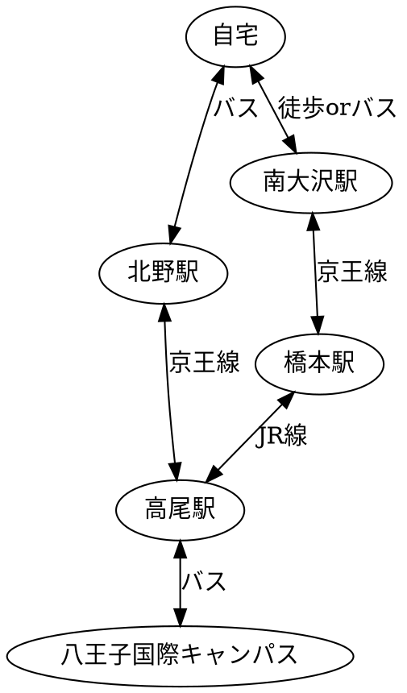

# 蓑原の通学経路

[メンバー表に戻る](member.md#メンバー表)

```graphviz
digraph {
    edge [dir=both]
    自宅 -> 北野駅 [label=バス]
    北野駅 -> 高尾駅 [label=京王線]
    高尾駅 -> 八王子国際キャンパス [label=バス]
    自宅 -> 南大沢駅 [label=徒歩orバス]
    南大沢駅->橋本駅 [label=京王線]
    橋本駅->高尾駅 [label=JR線]
}
```
